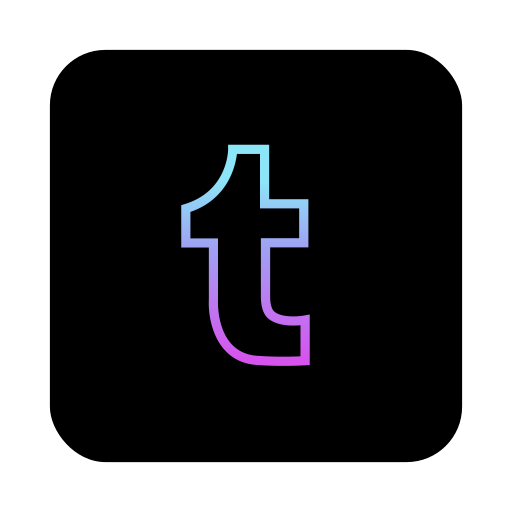

<h1 align="left">Hi there 👋 I'm Charmaine — ᵃᵏᵃ ξ(🎀˶❛◡❛) ᵀᴴᴱ ᴿᴵᴮᴮᴼᴺ ᴳᴵᴿᴸ</h1>
<h3 align="left">👩‍💻 Data Analyst | Web Developer | ✍️ Technical Writer</h3>
<h3 align="left">Domain expertise include:</h3>
<ul>
  <li>🌐 Geospatial & GIS-related applications</li>
  <li>💉 Healthcare Analytics (e.g. 🩺 Clinical Outcomes, 💊 Pharmaceuticals)</li>
</ul>

<h2 align="left">🎓 ❝Firm believer of lifelong learning❞</h2>

<h3 align="left">📝 Recent posts on <a target="_blank" href="https://medium.com/@geek-cc">Medium</a></h3>

<strong>№𝟷</strong> <a target="_blank" href="https://javascript.plainenglish.io/generate-icon-images-from-font-symbols-using-vanilla-javascript-b8da434378ee">Generate Icon Images From Font Symbols Using Vanilla JavaScript</a>✏️

<strong>№𝟸</strong> <a target="_blank" href="https://javascript.plainenglish.io/6-useful-html-features-you-probably-forgot-existed-f731175846c0">6 Useful HTML Features You Probably Forgot Existed</a>✏️

<strong>№𝟹</strong> <a target="_blank" href="https://javascript.plainenglish.io/how-to-convert-string-to-buffer-and-data-url-formats-using-client-side-javascript-9514a8c446d2">How To Convert String To Buffer And Data URL Formats Using Client-Side JavaScript</a>✏️

<h3 align="left">🧰 <a target="_blank" href="https://incubated-geek-cc.github.io/">[Github Pages ∷ Link ∷ Other productivity tools]</a></h3>

<h3 align="left">📘 List of side projects*</h3>
*2 motivations behind side projects: (1) 🤓 Learning and (2) Create open-sourced tools to better the lives of others 🌈
 
<h4 align="left">Geospatial Analytics</h4>
<ul>
  <li>Real-time 🚍 Bus ETA: <a target="_blank" href="https://sg-transportation.glitch.me/">SG Bus Transportation Web App</a></li>
  <li>🏙️ 3D Residential Map Layer: <a target="_blank" href="https://sg-hdb-building-layer-in-3d.onrender.com/">SG HDB Building Layer in 3D Web App</a></li>
  <li>⇉⇈🚦⇈⇉ Exploring the ❝Travelling Salesman Problem❞: <a target="_blank" href="https://sg-routing-app.glitch.me/">SG Routing Web App</a></li>
</ul>
  
<h4 align="left">Built with WebAssembly (Wasm) or A.I. Tools</h4>
<ul>
  <li>『🔎📰』PDF & Image Text Extraction (with Tesseract OCR) + 🗣Speech Synthesis: <a target="_blank" href="https://incubated-geek-cc.github.io/Text-To-Speech-App/">Text-to-Speech Web App</a></li>
  <li>『📰🔍』PDF & Image Text Extraction (with Tesseract OCR): <a target="_blank" href="https://github.com/incubated-geek-cc/Tess4JOcrApp">Tesseract OCR Native Java App</a></li>
  <li>🔌 Offline browser-based SQLite Database: <a target="_blank" href="https://incubated-geek-cc.github.io/SQLiteBrowserUtility/">SQLite Web Utility</a></li>
  <li>💽 Transcoding Audio/Video with FFmpeg into other multimedia formats: <a target="_blank" href="https://ffmpegwasm.glitch.me/">Media Transcoder Web App</a></li>
</ul>
  
<h4 align="left">Other Productivity Tools</h4>
<ul>
    <li>🧰 A collection of data transformation utilities for Tableau dashboarding: <a target="_blank" href="https://tableau-data-utility.onrender.com/">Tableau Data Web Utility</a></li>
    <li>🛠️ All-in-one text manipulation toolkit: <a target="_blank" href="https://incubated-geek-cc.github.io/text-manipulation/">Text Manipulation Web App</a></li>
    <li>⚙️ PDF Embedded Font Extractor: <a target="_blank" href="https://github.com/incubated-geek-cc/pdf-font-extractor">PDF Font Extractor Java App</a></li>
</ul>

<h2 align="left">🤝 Connect with me</h2>

  
  
  
  

— Would appreciate it 😋
